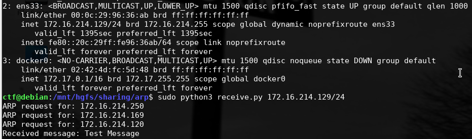
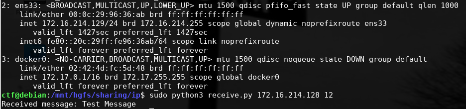
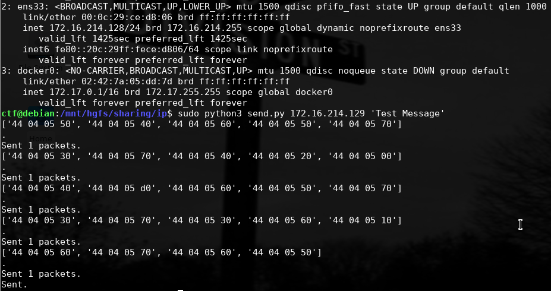

# Исследование методов сетевой стеганографии в семействе протоколов TCP/IP 

Для запуска скриптов необходим интерпретатор языка Python3 и бибилотека [Scapy](https://scapy.readthedocs.io/en/latest/installation.html#installing-scapy-v2-x). В работе использовалась операционная система Linux *(Linux debian 4.19.0-16-amd64 #1 SMP Debian 4.19.181-1 (2021-03-19) x86_64 GNU/Linux)*. 

# Метод 1 (папка arp)

Скрипт для получения сообщения:

```
usage: receive.py [-h] [-s] [-f FILE] [-i INTERFACE] network

positional arguments:
  network               network ip (or host ip from the network)/network
                        prefix. Example: 192.168.0.1/24

optional arguments:
  -h, --help            show this help message and exit
  -s, --scan            Scan for unallocated IPs and exit
  -f FILE, --file FILE  read a list of unallocated IPs from the file (IPs are
                        new line separated)
  -i INTERFACE, --interface INTERFACE
                        Name of the network interface. Picks default if
                        unspecidied

```

Скрипт для отправки сообщения:

```
usage: send.py [-h] [-s] [-f FILE] [-i INTERFACE] target message

positional arguments:
  target                receiver's ip/network prefix. Example: 192.168.0.1/24
  message               ASCII text to send

optional arguments:
  -h, --help            show this help message and exit
  -s, --scan            Scan for unallocated IPs and exit
  -f FILE, --file FILE  read a list of unallocated IPs from the file (IPs are
                        new line separated)
  -i INTERFACE, --interface INTERFACE
                        Name of the network interface. Picks default if
                        unspecidied

```

## Пример
Получатель:


Отправитель:


# Метод 2 (папка ip)

Скрипт для получения сообщения:

```
usage: receive.py [-h] sender length

positional arguments:
  sender      senders's ip. Example: 192.168.0.1
  length      length of a message in bytes

optional arguments:
  -h, --help  show this help message and exit
```

Скрипт для отправки сообщения:

```
usage: send.py [-h] target message

positional arguments:
  target      receiver's ip. Example: 192.168.0.1
  message     ASCII text to send

optional arguments:
  -h, --help  show this help message and exit
```

## Пример
Получатель:


Отправитель:



# Статьи
1. Bedi P, Dua A. ARPNetSteg: Network Steganography using Address Resolution Protocol. International Journal of Electronics and Telecommunications. 2020 Nov 22;66(4):671-7.
2. Bedi P, Dua A. Network steganography using the overflow field of timestamp option in an IPv4 packet. Procedia Computer Science. 2020 Jan 1;171:1810-8.
